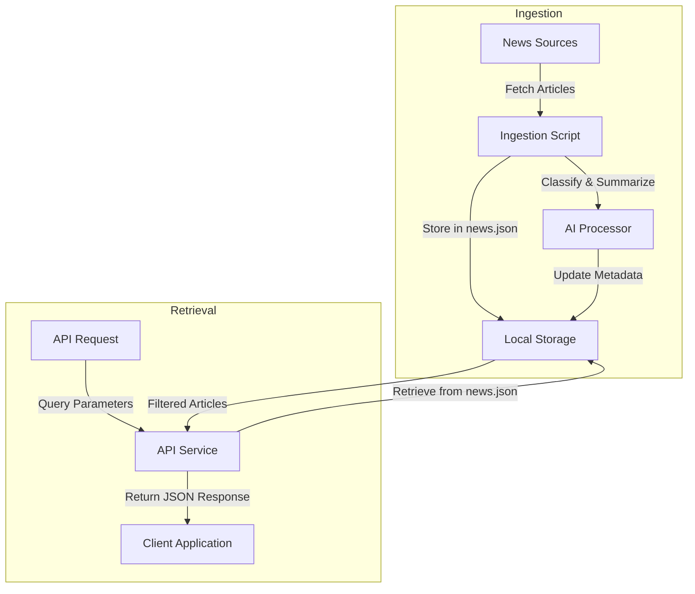

# Product Requirements Document (PRD)

## MK News Copilot

### 1. Product Overview & Vision

**MK News Copilot** is a B2B sales intelligence application that aggregates and provides access to relevant news events from various sources. It enables sales representatives to stay informed about prospects and customers by offering an API that delivers news tagged by company and topic. This streamlined version utilizes local JSON files for data storage and operates exclusively through API endpoints.

---

### 2. Goals & Objectives

- Aggregate and store news articles and company information in local JSON files.
- Classify news articles using AI to assign relevant topics and company tags.
- Provide an API for users to access and manage news articles and subscriptions.
- Deliver a minimal viable product (MVP) without a user interface, focusing on API interactions.

---

### 3. Key Features

#### 3.1 Data Ingestion & Storage

- Aggregate news from:
  - General tech/business news sources (e.g., TechCrunch, Bloomberg)
  - Industry-specific sources (e.g., cybersecurity, dev tools)
  - Public filings (e.g., SEC EDGAR)
- Store articles in a local `news.json` file with metadata: title, link, full text, source, date.
- Maintain company information in a local `companies.json` file with details: name, logo URL, size, industry, headquarters location.

#### 3.2 Tagging System

- Utilize a predefined set of tags relevant to B2B sales, such as Fundraising, Cybersecurity Incident, Acquisition, Layoffs, Product Launch, Executive Hire.
- Allow users to create custom topics; these will be normalized and integrated into the existing taxonomy.

#### 3.3 AI-Powered Classification & Summarization

- Employ GPT-3.5 to tag each news article by:
  - Identified companies mentioned
  - Relevant topics and generic business categories
- Use GPT-4o to generate concise summaries (1–2 sentences) for each article.

#### 3.4 API Endpoints

- Provide endpoints to:
  - Retrieve news articles based on company, topic, or date range.
  - Subscribe to specific companies or topics.
  - Manage user subscriptions.
  - Access company information.

---

### 4. User Stories

#### 4.1 Onboarding

> As a sales representative, I want to subscribe to news about specific companies and topics relevant to my industry. Using the API, I can add subscriptions to companies and topics of interest. Subsequently, I can retrieve a personalized feed of news articles related to my subscriptions.

#### 4.2 Ongoing Use

> As a sales representative, I want to stay updated on recent developments in my industry. I use the API to fetch the latest news articles tagged with my subscribed companies and topics. Additionally, I can modify my subscriptions as my interests evolve.

---

### 5. Functional Requirements

- **Ingestion Script**: A script to fetch and store news articles from various sources into the local `news.json` file.
- **Classification Pipeline**: Process each article using GPT-3.5 for tagging and GPT-4o for summarization.
- **API Service**: Provide endpoints for:
  - Fetching news articles based on filters (company, topic, date range).
  - Managing user subscriptions to companies and topics.
  - Accessing company information from the `companies.json` file.

---

### 6. Technical Stack

| Layer     | Technology                                                    |
| --------- | ------------------------------------------------------------- |
| Backend   | Python (e.g., Flask or FastAPI)                               |
| AI/ML     | GPT-3.5 (classification), GPT-4o (summarization), OpenAI APIs |
| Data      | Local JSON files (`news.json` and `companies.json`)           |
| Ingestion | Custom scripts to fetch and store news data locally           |
| Auth      | API key-based authentication (for future implementation)      |

---

### 7. Non-Functional Requirements

- Efficient handling of local JSON files to ensure quick read and write operations.
- AI inference latency under 5 seconds per article.
- Secure access to API endpoints.
- Modular and maintainable codebase to facilitate future enhancements.

---

### 8. Architecture Diagram

